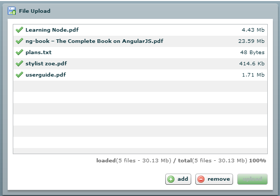

Flex FileUpload Component
=========================

Flex FileUpload Component Java 版本, [原始代码](http://www.zehnet.de/2009/02/23/flex-fileupload-component/#more-264)提供的是基于Php实现的服务器端文件上传，这里主要使用Java重写了Php的代码。

## Screenshots

选择文件上传

文件已存在对话框

## TODOS

* 超大文件上传

* 文件上传暂停与恢复
